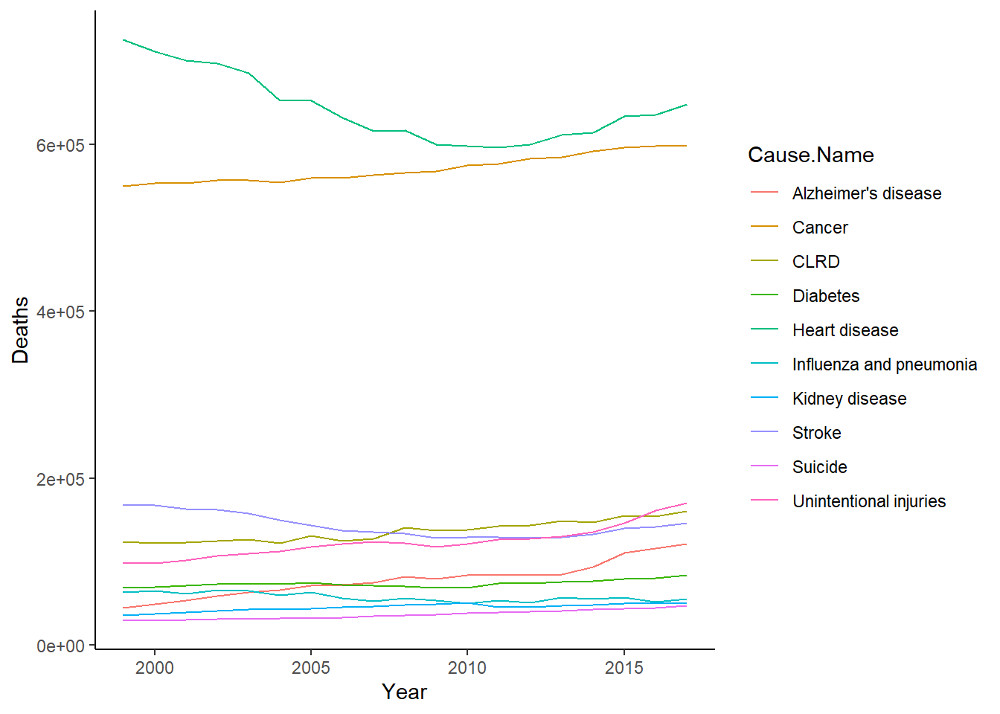
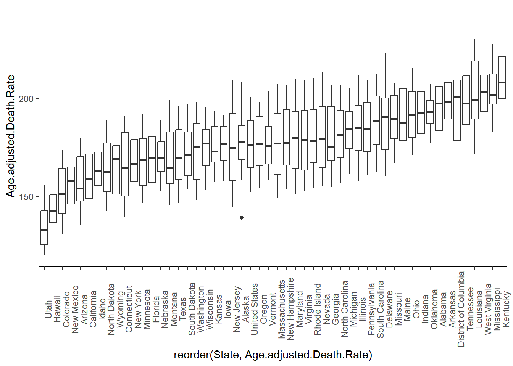

For this exercise, the dataset I'll be working on is called the [NCHS - Leading causes of Death: United States](https://data.cdc.gov/National-Center-for-Health-Statistics/NCHS-Leading-Causes-of-Death-United-States/bi63-dtpu/about_data). In summary, this dataset presents the age-adjust death rates for the 10 leading causes of death in the United States since 1999. 

Published by the **National Center for Health Statistics**, the dataset is described as follows:

*"Data are based on information from all resident death certificates filed in the 50 states and the District of Columbia using demographic and medical characteristics. Age-adjusted death rates (per 100,000 population) are based on the 2000 U.S. standard population. Populations used for computing death rates after 2010 are postcensal estimates based on the 2010 census, estimated as of July 1, 2010. Rates for census years are based on populations enumerated in the corresponding censuses. Rates for non-census years before 2010 are revised using updated intercensal population estimates and may differ from rates previously published.*

*Causes of death classified by the International Classification of Diseases, Tenth Revision (ICD–10) are ranked according to the number of deaths assigned to rankable causes. Cause of death statistics are based on the underlying cause of death."*

**Load Libraries**

::: {.cell}

```{.r .cell-code}
library(tidyverse)
library(dplyr)
library(ggplot2)
library(here)
library(gridExtra)
```
:::


**Load Data**

::: {.cell}

```{.r .cell-code}
raw_data <- read.csv2(here("cdcdata-exercise", "NCHS_-_Leading_Causes_of_Death__United_States_20260209.csv"), sep = ",")
```
:::


**Check Data**

::: {.cell}

```{.r .cell-code}
nrow(raw_data) #counting rows = counting entries
```

::: {.cell-output .cell-output-stdout}

```
[1] 10868
```


:::

```{.r .cell-code}
ncol(raw_data) #counting columns = counting variables
```

::: {.cell-output .cell-output-stdout}

```
[1] 6
```


:::

```{.r .cell-code}
str(raw_data) #check structure
```

::: {.cell-output .cell-output-stdout}

```
'data.frame':	10868 obs. of  6 variables:
 $ Year                   : int  2012 2017 2016 2013 2000 2014 2009 2015 2014 2011 ...
 $ X113.Cause.Name        : chr  "Nephritis, nephrotic syndrome and nephrosis (N00-N07,N17-N19,N25-N27)" "Nephritis, nephrotic syndrome and nephrosis (N00-N07,N17-N19,N25-N27)" "Nephritis, nephrotic syndrome and nephrosis (N00-N07,N17-N19,N25-N27)" "Nephritis, nephrotic syndrome and nephrosis (N00-N07,N17-N19,N25-N27)" ...
 $ Cause.Name             : chr  "Kidney disease" "Kidney disease" "Kidney disease" "Kidney disease" ...
 $ State                  : chr  "Vermont" "Vermont" "Vermont" "Vermont" ...
 $ Deaths                 : chr  "21" "29" "30" "30" ...
 $ Age.adjusted.Death.Rate: chr  "2.6" "3.3" "3.7" "3.8" ...
```


:::

```{.r .cell-code}
head(raw_data) #check top of data
```

::: {.cell-output .cell-output-stdout}

```
  Year                                                       X113.Cause.Name
1 2012 Nephritis, nephrotic syndrome and nephrosis (N00-N07,N17-N19,N25-N27)
2 2017 Nephritis, nephrotic syndrome and nephrosis (N00-N07,N17-N19,N25-N27)
3 2016 Nephritis, nephrotic syndrome and nephrosis (N00-N07,N17-N19,N25-N27)
4 2013 Nephritis, nephrotic syndrome and nephrosis (N00-N07,N17-N19,N25-N27)
5 2000                  Intentional self-harm (suicide) (*U03,X60-X84,Y87.0)
6 2014 Nephritis, nephrotic syndrome and nephrosis (N00-N07,N17-N19,N25-N27)
      Cause.Name                State Deaths Age.adjusted.Death.Rate
1 Kidney disease              Vermont     21                     2.6
2 Kidney disease              Vermont     29                     3.3
3 Kidney disease              Vermont     30                     3.7
4 Kidney disease              Vermont     30                     3.8
5        Suicide District of Columbia     23                     3.8
6 Kidney disease              Arizona    325                     4.1
```


:::

```{.r .cell-code}
tail(raw_data) #check bottom of data
```

::: {.cell-output .cell-output-stdout}

```
      Year X113.Cause.Name Cause.Name                State Deaths
10863 1999      All Causes All causes          Mississippi 28,185
10864 2001      All Causes All causes District of Columbia  5,951
10865 2002      All Causes All causes          Mississippi 28,853
10866 2000      All Causes All causes          Mississippi 28,654
10867 2000      All Causes All causes District of Columbia  6,001
10868 1999      All Causes All causes District of Columbia  6,076
      Age.adjusted.Death.Rate
10863                 1,043.4
10864                 1,049.9
10865                 1,051.6
10866                 1,051.9
10867                 1,061.2
10868                 1,087.3
```


:::

```{.r .cell-code}
colSums(is.na(raw_data)) #check for missing data
```

::: {.cell-output .cell-output-stdout}

```
                   Year         X113.Cause.Name              Cause.Name 
                      0                       0                       0 
                  State                  Deaths Age.adjusted.Death.Rate 
                      0                       0                       0 
```


:::

```{.r .cell-code}
unique(raw_data$Year)
```

::: {.cell-output .cell-output-stdout}

```
 [1] 2012 2017 2016 2013 2000 2014 2009 2015 2011 2001 1999 2006 2002 2003 2008
[16] 2005 2004 2007 2010
```


:::

```{.r .cell-code}
unique(raw_data$State) 
```

::: {.cell-output .cell-output-stdout}

```
 [1] "Vermont"              "District of Columbia" "Arizona"             
 [4] "South Dakota"         "Washington"           "Iowa"                
 [7] "New York"             "Massachusetts"        "New Jersey"          
[10] "North Dakota"         "California"           "Rhode Island"        
[13] "Oregon"               "Alaska"               "Wyoming"             
[16] "Idaho"                "Connecticut"          "Minnesota"           
[19] "Illinois"             "Montana"              "New Hampshire"       
[22] "Hawaii"               "Maryland"             "Colorado"            
[25] "Florida"              "Nevada"               "Delaware"            
[28] "Utah"                 "Nebraska"             "Ohio"                
[31] "New Mexico"           "Michigan"             "Maine"               
[34] "Oklahoma"             "Pennsylvania"         "Texas"               
[37] "Tennessee"            "Georgia"              "Louisiana"           
[40] "United States"        "Indiana"              "Mississippi"         
[43] "South Carolina"       "Virginia"             "Kansas"              
[46] "Wisconsin"            "North Carolina"       "Alabama"             
[49] "Kentucky"             "Missouri"             "West Virginia"       
[52] "Arkansas"            
```


:::

```{.r .cell-code}
unique(raw_data$Cause.Name)
```

::: {.cell-output .cell-output-stdout}

```
 [1] "Kidney disease"          "Suicide"                
 [3] "Influenza and pneumonia" "Alzheimer's disease"    
 [5] "Diabetes"                "CLRD"                   
 [7] "Unintentional injuries"  "Stroke"                 
 [9] "Heart disease"           "Cancer"                 
[11] "All causes"             
```


:::

```{.r .cell-code}
unique(raw_data$X113.Cause.Name)
```

::: {.cell-output .cell-output-stdout}

```
 [1] "Nephritis, nephrotic syndrome and nephrosis (N00-N07,N17-N19,N25-N27)"
 [2] "Intentional self-harm (suicide) (*U03,X60-X84,Y87.0)"                 
 [3] "Influenza and pneumonia (J09-J18)"                                    
 [4] "Alzheimer's disease (G30)"                                            
 [5] "Diabetes mellitus (E10-E14)"                                          
 [6] "Chronic lower respiratory diseases (J40-J47)"                         
 [7] "Accidents (unintentional injuries) (V01-X59,Y85-Y86)"                 
 [8] "Cerebrovascular diseases (I60-I69)"                                   
 [9] "Diseases of heart (I00-I09,I11,I13,I20-I51)"                          
[10] "Malignant neoplasms (C00-C97)"                                        
[11] "All Causes"                                                           
```


:::
:::


From checking the data, here's what stood out to me:

_1. Variables "Deaths" and "Age.adjusted.Death.Rate" are numbers but are stored as characters (I assume) because of commas._

_2. Fortunately, the dataset doesn't appear to have missing data._

_3. Year only runs from 1999 to 2017._

_4. 52 states are listed because in addition to the 50 states, the variable State also contains "District of Columbia" and "United States."_

_5. It seems like there are two variables that describe the same thing: cause of death. It's just that one is more simplified than the other._

**Clean Data**

::: {.cell}

```{.r .cell-code}
#Duplicating dataframe to clean up
clean_data <- raw_data

#converting variables "Deaths" and "Age.adjusted.Death.Rate" into integer and numerical variables
#Using gsub to remove the commas
clean_data$Deaths <- as.integer(gsub(",", "", clean_data$Deaths))
clean_data$Age.adjusted.Death.Rate <- as.numeric(gsub(",", "", clean_data$Age.adjusted.Death.Rate))
```
:::


**Exploratory Data Analysis**


::: {.cell}

```{.r .cell-code}
#Let's see how each cause of death did throughout the years

clean_data %>% 
    group_by(Cause.Name) %>%
    filter(State == "United States") %>%
    summarise(total_deaths = sum(Deaths)) %>%
    arrange(desc(total_deaths))
```

::: {.cell-output .cell-output-stdout}

```
# A tibble: 11 × 2
   Cause.Name              total_deaths
   <chr>                          <int>
 1 All causes                  47728569
 2 Heart disease               12222640
 3 Cancer                      10843644
 4 Stroke                       2726523
 5 CLRD                         2594927
 6 Unintentional injuries       2347820
 7 Alzheimer's disease          1494816
 8 Diabetes                     1399943
 9 Influenza and pneumonia      1094641
10 Kidney disease                858613
11 Suicide                       697016
```


:::

```{.r .cell-code}
P1 <- clean_data %>%
    filter(State == "United States") %>%
    filter(Cause.Name == "Heart disease") %>%
    ggplot(aes(x = Year, y = Deaths)) +
    geom_line()+
    theme_classic()+
    labs(title = "Heart Disease")

P2 <- clean_data %>%
    filter(State == "United States") %>%
    filter(Cause.Name == "Cancer") %>%
    ggplot(aes(x = Year, y = Deaths)) +
    geom_line()+
    theme_classic()+
    labs(title = "Cancer")

P3 <- clean_data %>%
    filter(State == "United States") %>%
    filter(Cause.Name == "Stroke") %>%
    ggplot(aes(x = Year, y = Deaths)) +
    geom_line()+
    theme_classic()+
    labs(title = "Stroke")

P4 <- clean_data %>%
    filter(State == "United States") %>%
    filter(Cause.Name == "CLRD") %>%
    ggplot(aes(x = Year, y = Deaths)) +
    geom_line()+
    theme_classic()+
    labs(title = "CLRD")

P5 <- clean_data %>%
    filter(State == "United States") %>%
    filter(Cause.Name == "Unintentional injuries") %>%
    ggplot(aes(x = Year, y = Deaths)) +
    geom_line()+
    theme_classic()+
    labs(title = "Unintentional Injuries")

P6 <- clean_data %>%
    filter(State == "United States") %>%
    filter(Cause.Name == "Alzheimer's disease") %>%
    ggplot(aes(x = Year, y = Deaths)) +
    geom_line()+
    theme_classic()+
    labs(title = "Alzheimer's Disease")

P7 <- clean_data %>%
    filter(State == "United States") %>%
    filter(Cause.Name == "Diabetes") %>%
    ggplot(aes(x = Year, y = Deaths)) +
    geom_line()+
    theme_classic()+
    labs(title = "Diabetes")
    
P8 <- clean_data %>%
    filter(State == "United States") %>%
    filter(Cause.Name == "Influenza and pneumonia") %>%
    ggplot(aes(x = Year, y = Deaths)) +
    geom_line()+
    theme_classic()+
    labs(title = "Influenza and Pneumonia")

P9 <- clean_data %>%
    filter(State == "United States") %>%
    filter(Cause.Name == "Kidney disease") %>%
    ggplot(aes(x = Year, y = Deaths)) +
    geom_line()+
    theme_classic()+
    labs(title = "Kidney Disease")

P10 <- clean_data %>%
    filter(State == "United States") %>%
    filter(Cause.Name == "Suicide") %>%
    ggplot(aes(x = Year, y = Deaths)) +
    geom_line()+
    theme_classic()+
    labs(title = "Suicide")

grid.arrange(P1, P2, P3, P4, P5, P6, P7, P8, P9, P10, ncol = 2, nrow = 5)
```

::: {.cell-output-display}
{width=672}
:::

```{.r .cell-code}
#Let's see how they all did when graphed together.

clean_data %>%
    filter(State == "United States") %>%
    filter(!Cause.Name == "All causes") %>%
    ggplot(aes(x = Year, y = Deaths, group = Cause.Name, color = Cause.Name)) +
    geom_line()+
    theme_classic()
```

::: {.cell-output-display}
{width=672}
:::

```{.r .cell-code}
#Being in Georgia, let's see the top causes of death in Georgia and see if the order would match the order seen when looking across the whole country.

clean_data %>%
    group_by(Cause.Name) %>%
    filter(State == "Georgia") %>%
    summarise(total_deaths = sum(Deaths)) %>%
    arrange(desc(total_deaths))
```

::: {.cell-output .cell-output-stdout}

```
# A tibble: 11 × 2
   Cause.Name              total_deaths
   <chr>                          <int>
 1 All causes                   1342156
 2 Heart disease                 320627
 3 Cancer                        288055
 4 Stroke                         76839
 5 Unintentional injuries         72052
 6 CLRD                           70638
 7 Alzheimer's disease            40922
 8 Diabetes                       34811
 9 Kidney disease                 30459
10 Influenza and pneumonia        29096
11 Suicide                        20610
```


:::
:::


From our exploratory data analysis, these are what stood out to me:

1. A couple of causes of death, like heart disease and stroke, actually dipped toward 2010 and slowly climbed back up.

2. On the other hand, few other causes of death steadily increased across time (e.g., cancer, unintentional injuries, CLRD, Alzheimer's, suicide.

3. Looking at them all together, we get a better sense of how vast the difference is in the deaths caused by heart disease and cancer compared to all other causes of death.

3. When looking at Georgia compared to the national perspective:
    a. unintentional injuries were more prevalent than CLRD,
    b. kidney diseases were more prevalent than influenza and pneumonia.

**Specific Questions**
_1. Which states have the highest and lowest death rates from cancer?_

::: {.cell}

```{.r .cell-code}
clean_data %>%
    filter(Cause.Name == "Cancer") %>%
    ggplot(aes(x = reorder(State, Age.adjusted.Death.Rate), y = Age.adjusted.Death.Rate)) +
    geom_boxplot()+
    theme_classic()+
    theme(axis.text.x = element_text(angle = 90))
```

::: {.cell-output-display}
{width=672}
:::

```{.r .cell-code}
clean_data %>%
    filter(!State == "United States") %>%
    filter(Cause.Name == "Cancer") %>%
    ggplot(aes(x = reorder(State, Deaths), y = Deaths)) +
    geom_boxplot()+
    theme_classic()+
    theme(axis.text.x = element_text(angle = 90))
```

::: {.cell-output-display}
{width=672}
:::
:::


It's interesting to see conclusions based on looking at more than one variable. For example, just by looking at the number of deaths due to cancer, we see that California has the highest number of deaths due to cancer than other states. However, if we look at the death rates, California actually ranks really low. In fact, the top three states with the most deaths due to cancer (California, Florida, Texas), are actually on the bottom half when looking at death rates. 

_2. Cancer has gone up over the years. How has the death rate been?_

::: {.cell}

```{.r .cell-code}
P2b <- clean_data %>%
    filter(State == "United States") %>%
    filter(Cause.Name == "Cancer") %>%
    ggplot(aes(x = Year, y = Age.adjusted.Death.Rate)) +
    geom_line()+
    theme_classic()

grid.arrange(P2, P2b, ncol = 2, nrow = 1)
```

::: {.cell-output-display}
{width=672}
:::
:::


So despite the number of deaths due to cancer going up, we've actually had amazing advances to reduce cancer death rates.

